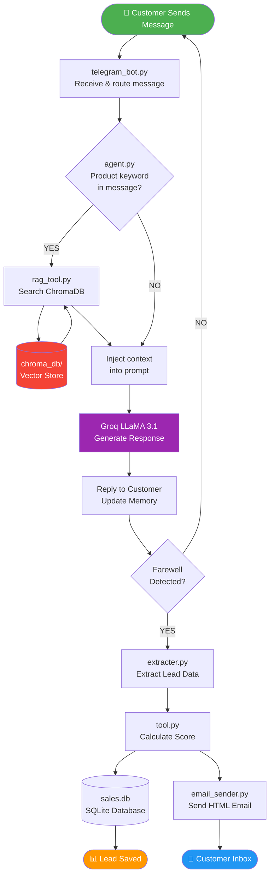

<div align="center">


<br/>

[](https://python.org)
[](https://groq.com)
[](https://langchain.com)
[](https://trychroma.com)
[](https://telegram.org)
[](https://railway.app)
[](LICENSE)

<br/>

> **An intelligent, multi-channel AI Sales Agent** that automatically qualifies inbound leads, scores them in real-time, saves them to a database, and sends a professional follow-up email — all without a single human salesperson.

<br/>

[](https://github.com/raghu4350/ai-sales-agent)
[](https://github.com/raghu4350/ai-sales-agent)

</div>

---

## 📋 Table of Contents

- [🚨 Problem Statement](#-problem-statement)
- [💡 Solution](#-solution)
- [⚡ Features](#-features)
- [🛠️ Tech Stack](#️-tech-stack)
- [🏗️ Full Architecture](#️-full-architecture)
- [🔄 Data Pipeline](#-data-pipeline)
- [📁 File-by-File Breakdown](#-file-by-file-breakdown)
- [🔗 File Connection Map](#-file-connection-map)
- [🚧 Challenges Faced](#-challenges-faced)
- [💼 Business Impact](#-business-impact)
- [🚀 Local Setup](#-local-setup)
- [☁️ Deploy on Railway](#️-deploy-on-railway)

---

## 🚨 Problem Statement

<table>
<tr>
<td width="50%">

### ❌ Before (Manual Process)

- Every customer needed a **human salesperson**
- **15–20 minutes** wasted per unqualified lead  
- No follow-up emails sent consistently
- **No availability** on nights, weekends, holidays
- Salespeople couldn't tell HIGH vs LOW priority leads
- Data scattered across spreadsheets — no central DB
- Agents sometimes offered **non-existent products**

</td>
<td width="50%">

### ✅ After (AI Agent)

- AI handles **unlimited simultaneous customers**
- Full lead qualification in **2–3 minutes**
- Professional HTML email sent **instantly & automatically**
- **24/7 availability** — never sleeps
- Automatic **HIGH / MEDIUM / LOW** lead scoring
- Every lead stored in a **structured SQLite database**
- RAG system ensures **only real products** are discussed

</td>
</tr>
</table>

---

## 💡 Solution

A multi-channel **AI Sales Qualification Agent** built on a **RAG (Retrieval Augmented Generation)** architecture. The agent engages customers in natural conversation, collects structured lead data, and automates the entire post-conversation workflow.

**Supported Channels:**

| Channel | Status | Entry Point |
|---|---|---|
| 📱 Telegram Bot | ✅ Live 24/7 (Railway) | `telegram_bot.py` |
| 📞 Twilio Voice Call | ✅ Available | `voice_agent.py` |
| 💻 Terminal Chat | ✅ For testing | `main.py` |

---

## ⚡ Features

- 🧠 **Intelligent Conversation** — Collects name, need, budget, urgency, email, callback preference
- 🔍 **RAG-powered Knowledge** — ChromaDB vector search prevents hallucination
- 🎯 **Lead Scoring** — Automatic HIGH / MEDIUM / LOW scoring
- 💾 **Persistent Storage** — SQLite database stores every lead permanently
- 📧 **Auto Email** — Professional HTML summary email to customer on session end
- 🛡️ **Product Guardrails** — Agent ONLY sells products that exist in the knowledge base
- 🔄 **Session Memory** — Full conversation history maintained per user
- ☁️ **Cloud Ready** — `startup.py` auto-initializes DB + RAG on first deploy

---

## 🛠️ Tech Stack

<div align="center">

| Category | Technology | Purpose |
|---|---|---|
| **Language** | Python 3.12+ | Core runtime |
| **AI Model** | Groq (LLaMA 3.1) | LLM for conversation |
| **LLM Framework** | LangChain | Prompt management & chaining |
| **Vector Store** | ChromaDB | Semantic product search |
| **Embeddings** | HuggingFace `all-MiniLM-L6-v2` | Text → Vector conversion |
| **Database** | SQLite | Lead data persistence |
| **Telegram** | python-telegram-bot | Telegram channel |
| **Voice** | Twilio + Flask | Phone call channel |
| **Email** | smtplib (Gmail SMTP) | Customer summary emails |
| **Cloud** | Railway.app | 24/7 deployment |
| **Version Control** | GitHub | Code + auto-deploy trigger |
| **Secrets** | python-dotenv | Secure API key management |

</div>

---

## 🏗️ Full Architecture

```
┌─────────────────────────────────────────────────────────────┐
│                        CUSTOMER INPUT                        │
│   📱 Telegram Bot  │  📞 Voice Call  │  💻 Terminal Chat    │
└────────────┬────────────────┬─────────────────┬─────────────┘
             │                │                 │
     telegram_bot.py    voice_agent.py       main.py
             │                │                 │
             └────────────────┴─────────────────┘
                              │
                              ▼
            ┌─────────────────────────────────────┐
            │            agent.py                  │
            │        ── THE MAIN BRAIN ──          │
            │                                      │
            │  • Manages conversation memory       │
            │  • Sends prompts to Groq LLaMA       │
            │  • Decides when to use RAG           │
            │  • Detects session end (farewell)    │
            │  • Calls finalize_lead() on exit     │
            └──────────┬──────────────┬────────────┘
                       │              │
           ┌───────────┘              └───────────────┐
           ▼                                          ▼
  ┌─────────────────┐                    ┌────────────────────┐
  │   rag_tool.py   │                    │   extracter.py     │
  │                 │                    │                    │
  │ Semantic search │                    │ Extract structured │
  │ in ChromaDB     │                    │ lead data from     │
  │ + deduplication │                    │ conversation text  │
  └────────┬────────┘                    └─────────┬──────────┘
           │                                       │
           ▼                                       ▼
  ┌─────────────────┐                    ┌────────────────────┐
  │   chroma_db/    │                    │    models.py       │
  │                 │                    │                    │
  │ Vector database │                    │  LeadData schema   │
  │ (built by rag.py│                    │  (Pydantic model)  │
  │ from txt file)  │                    └─────────┬──────────┘
  └────────┬────────┘                              │
           │                                       ▼
           ▼                             ┌────────────────────┐
  ┌─────────────────┐                   │     tool.py        │
  │ data/           │                   │                    │
  │ product_info.txt│                   │ save_lead()        │
  │                 │                   │ calculate_score()  │
  │ Source knowledge│                   └─────────┬──────────┘
  │ for RAG system  │                             │
  └─────────────────┘                             ▼
                                       ┌────────────────────┐
                                       │   database.py      │
                                       │                    │
                                       │ Creates sales.db   │
                                       │ SQLite tables      │
                                       └─────────┬──────────┘
                                                 │
                                                 ▼
                                       ┌────────────────────┐
                                       │  email_sender.py   │
                                       │                    │
                                       │ Sends HTML summary │
                                       │ to customer email  │
                                       └────────────────────┘
```

---

## 🔄 Data Pipeline



---

## 📁 File-by-File Breakdown

<details>
<summary><b>🔴 agent.py — The Main Brain (Click to expand)</b></summary>

**Role:** Orchestrator — Everything passes through here.

| What it does | How |
|---|---|
| Manages conversation memory | `conversation_memory` dict — per user |
| Builds prompt for LLM | `SYSTEM_PROMPT` + message history + RAG context |
| Decides when to use RAG | Checks for product keywords like "insurance", "coverage" |
| Detects session end | Checks `FAREWELL_KEYWORDS` — "bye", "thank you", "done" |
| Runs the finalize pipeline | `finalize_lead()` → extract → score → save → email |

**Key Functions:**
```python
get_agent_response(call_sid, user_message)  # Main entry point
finalize_lead(call_sid)                      # End of session pipeline
build_conversation_text(messages)            # Format memory for extractor
```
</details>

<details>
<summary><b>🟠 rag.py — Knowledge Base Builder (Click to expand)</b></summary>

**Role:** One-time setup script. Reads product data and builds the vector store.

| Step | Action |
|---|---|
| 1 | Read `data/product_info.txt` |
| 2 | Split into 300-char chunks with `RecursiveCharacterTextSplitter` |
| 3 | Convert each chunk to vector via HuggingFace embeddings |
| 4 | Store all vectors in `chroma_db/` folder |

**Runs only once** — `startup.py` checks if `chroma_db/` exists before running it again.
</details>

<details>
<summary><b>🟡 rag_tool.py — Knowledge Searcher (Click to expand)</b></summary>

**Role:** Retrieves relevant product context for every product-related query.

| Feature | Detail |
|---|---|
| Search | Semantic similarity search (top 3 chunks) |
| Deduplication | Removes duplicate chunks (critical fix) |
| Output | Clean context string injected into LLM prompt |

**Critical Bug Fixed:**  
Same chunk was returning 2-3 times → Added `seen` set to deduplicate results.
</details>

<details>
<summary><b>🟢 extracter.py — Lead Data Extractor (Click to expand)</b></summary>

**Role:** At session end, sends full conversation to LLM and extracts structured data.

**Output Format** (via `models.py`):
```python
LeadData(
    customer_name    = "Sima",
    customer_email   = "sima@gmail.com",
    customer_need    = "Health Insurance",
    budget           = "15 lakhs",
    urgency          = "1 month",
    callback_required = False,
    lead_status      = "Not provided"
)
```
</details>

<details>
<summary><b>🔵 tool.py — Database Operations (Click to expand)</b></summary>

**Role:** All SQLite read/write operations + lead scoring logic.

**Lead Scoring Algorithm:**
```
Has clear need?   +1
Has budget?       +1
Has urgency?      +1
Wants callback?   +1

Score 3-4 → HIGH
Score 2   → MEDIUM
Score 0-1 → LOW
```
</details>

<details>
<summary><b>🟣 database.py — Database Setup (Click to expand)</b></summary>

**Role:** Creates the SQLite database and `leads` table if they don't exist.

```sql
CREATE TABLE IF NOT EXISTS leads (
    id                INTEGER PRIMARY KEY AUTOINCREMENT,
    customer_name     TEXT,
    customer_email    TEXT,
    customer_need     TEXT,
    budget            TEXT,
    urgency           TEXT,
    callback_required TEXT,
    lead_status       TEXT,
    timestamp         DATETIME DEFAULT CURRENT_TIMESTAMP
);
```

**Cloud Fix:** Added `os.makedirs(db_dir, exist_ok=True)` to create `/data/` folder automatically on Railway.
</details>

<details>
<summary><b>📧 email_sender.py — Email Service (Click to expand)</b></summary>

**Role:** Sends a beautiful HTML summary email to the customer on session end.

| Feature | Detail |
|---|---|
| Format | HTML + Plain text (dual format) |
| Protocol | Gmail SMTP (port 587, STARTTLS) |
| IPv4 Fix | `socket.getaddrinfo` monkey-patched for Railway containers |
| Error Handling | Auth error, SMTP error, connection error all caught separately |
</details>

<details>
<summary><b>🚀 startup.py — Cloud Entry Point (Click to expand)</b></summary>

**Role:** Auto-initializes everything before starting the bot. Used by Railway via `Procfile`.

```
[1/3] Setup SQLite database
[2/3] Check if ChromaDB exists → Build RAG if not
[3/3] Start Telegram bot
```
</details>

---

## 🔗 File Connection Map

```
startup.py
    │
    ├──▶ database.py          (create sales.db)
    ├──▶ rag.py               (build chroma_db/ IF not exists)
    │       └──▶ data/product_info.txt
    └──▶ telegram_bot.py      (start polling)
            └──▶ agent.py     (every message)
                    ├──▶ rag_tool.py         (IF product keyword)
                    │       └──▶ chroma_db/
                    └──▶ finalize_lead()     (IF farewell)
                            ├──▶ extracter.py
                            │       └──▶ models.py (LeadData)
                            ├──▶ tool.py
                            │       └──▶ database.py → sales.db
                            └──▶ email_sender.py → Gmail
```

---

## 🚧 Challenges Faced

<details>
<summary><b>🔴 Challenge 1: RAG Duplication Bug</b></summary>

**Problem:** ChromaDB was returning the same chunk 2–3 times, so the agent would repeat the same product info multiple times in a single response.

**Root Cause:** `k=3` search returned 3 results, but when product data was sparse, similar entries ranked identically.

**Fix:** Added a `seen` set in `rag_tool.py`:
```python
seen = set()
unique_docs = []
for doc in results:
    if doc.page_content not in seen:
        seen.add(doc.page_content)
        unique_docs.append(doc)
```
</details>

<details>
<summary><b>🔴 Challenge 2: LLM Hallucination (Train Insurance)</b></summary>

**Problem:** Customer asked for "train insurance" → Agent said *"Yes, we offer that!"* — completely fabricated!

**Root Cause:** LLaMA's general world knowledge overrode the RAG context. The system prompt wasn't strict enough.

**Fix (2-part):**
1. System prompt rule: *"You ONLY sell Health Insurance and Car Insurance. NEVER offer any other product."*
2. RAG injection now says: *"NEVER use your general world knowledge. ONLY use the knowledge base above."*
</details>

<details>
<summary><b>🔴 Challenge 3: SQLite Crash on Railway</b></summary>

**Problem:** `sqlite3.OperationalError: unable to open database file` on first deploy.

**Root Cause:** Python could create a file but NOT an entire directory path. `/data/` folder didn't exist on Railway's container.

**Fix:**
```python
db_dir = os.path.dirname(DB_PATH)
if db_dir:
    os.makedirs(db_dir, exist_ok=True)  # Create /data/ first!
connection = sqlite3.connect(DB_PATH)
```
</details>

<details>
<summary><b>🟡 Challenge 4: requirements.txt Not Found</b></summary>

**Problem:** `ModuleNotFoundError: langchain_text_splitters` on Railway.

**Root Cause:** File was named `requirement.txt` (no 's'). Railway only looks for `requirements.txt`.

**Fix:** Renamed the file → `git mv requirement.txt requirements.txt`
</details>

<details>
<summary><b>🟡 Challenge 5: Gmail "Network is Unreachable"</b></summary>

**Problem:** `OSError: [Errno 101] Network is unreachable` when sending email from Railway.

**Root Cause:** Python tried connecting to `smtp.gmail.com` via **IPv6**. Railway's free containers only allow **IPv4**.

**Fix:** Monkey-patched `socket.getaddrinfo` to filter IPv6:
```python
old_getaddrinfo = socket.getaddrinfo
def new_getaddrinfo(*args, **kwargs):
    responses = old_getaddrinfo(*args, **kwargs)
    return [r for r in responses if r[0] == socket.AF_INET]
socket.getaddrinfo = new_getaddrinfo
```
</details>

<details>
<summary><b>🟡 Challenge 6: Telegram Conflict Error</b></summary>

**Problem:** `Conflict: terminated by other getUpdates request`

**Root Cause:** Bot was running on BOTH local PC and Railway simultaneously. Telegram doesn't allow two instances of the same bot token polling at the same time.

**Fix:** Run bot in ONLY one place — either Railway (cloud) or PC (local). Never both.
</details>

---

## 💼 Business Impact

| Metric | Before | After |
|---|---|---|
| ⏱️ Time per lead | 15–20 min (human) | 2–3 min (AI) |
| 🕐 Availability | Business hours only | 24 / 7 / 365 |
| 📧 Follow-up emails | Manual, often forgotten | 100% automatic |
| 📊 Lead scoring | Subjective / inconsistent | Algorithmic (HIGH/MEDIUM/LOW) |
| 💸 Cost per lead | Salesperson salary | Near zero (AI API cost) |
| 📦 Data storage | Spreadsheets | Structured SQLite DB |
| 🛡️ Product accuracy | Could offer wrong products | RAG guardrails enforce scope |

---

## 🚀 Local Setup

```bash
# 1. Clone the repository
git clone https://github.com/raghu4350/ai-sales-agent.git
cd ai-sales-agent

# 2. Create virtual environment
python -m venv venv
venv\Scripts\activate       # Windows
# source venv/bin/activate  # Mac/Linux

# 3. Install dependencies
pip install -r requirements.txt

# 4. Setup environment variables
copy .env.example .env
# Edit .env and fill in your API keys

# 5. Initialize database & RAG
python database.py
python rag.py

# 6. Run the bot
python telegram_bot.py      # Telegram
# python main.py            # Terminal chat
# python voice_agent.py     # Voice (needs ngrok)
```

---

## ☁️ Deploy on Railway

```bash
# 1. Push to GitHub (already done!)
git add .
git commit -m "your message"
git push

# 2. Railway auto-deploys via Procfile:
# web: python startup.py
# startup.py handles: DB setup → RAG build → Bot start
```

**Environment Variables to add in Railway Dashboard:**

```env
GROQ_API_KEY=gsk_...
TELEGRAM_BOT_TOKEN=1234567890:ABC...
GMAIL_ADDRESS=your@gmail.com
GMAIL_APP_PASSWORD=xxxx xxxx xxxx xxxx
DB_PATH=/data/sales.db
```

> ⚠️ Add a Railway **Volume** mounted at `/data` to persist `sales.db` across restarts!

---

<div align="center">

**Built with ❤️ using Python, LangChain, Groq, ChromaDB & Railway**

[](https://github.com/raghu4350/ai-sales-agent)

</div>
